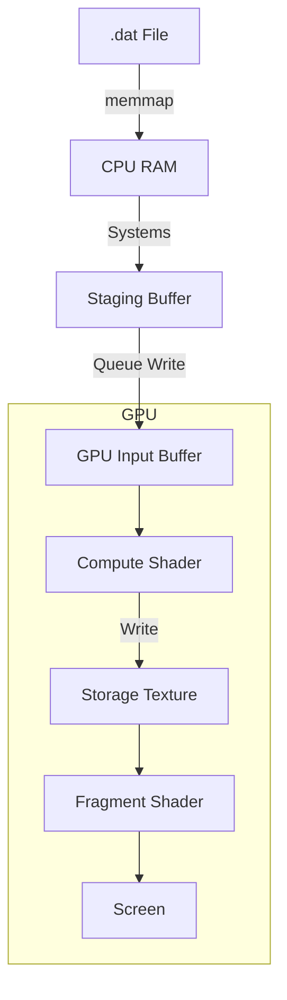

# GPU Pipeline Architecture

This document explains the "Secret Sauce" of `ebc-rs`: a high-performance pipeline that streams event data from disk, stages it on the CPU, and processes/renders it on the GPU using custom Compute and Render passes.

## 1. Data Ingestion (`loader.rs`)

The pipeline starts with raw data on disk.

-   **Format**: Custom `.dat` files containing event streams (x, y, polarity, timestamp).
-   **Loader**: `loader.rs` uses `memmap2` to map the file into memory. This allows us to access gigabytes of data without loading it all into RAM at once.
-   **Bevy Resource**: The file path is stored in the `EventFilePath` resource. The actual data loading happens in systems that read chunks of this data based on the current playback time.

## 2. CPU Staging

Before the GPU can touch the data, we must prepare it on the CPU.

-   **`EventBuffer`**: A CPU-side buffer (Vec) that holds the events for the *current frame*.
-   **Systems**: Bevy systems run every frame to:
    1.  Determine the current timestamp (based on playback speed).
    2.  Slice the memory-mapped file to get events within the `[t, t + dt]` window.
    3.  Convert these raw bytes into a format suitable for the GPU (e.g., `u32` packed events).
    4.  Update a `UniformBuffer` with metadata (resolution, time, parameters).

## 3. The Bridge: Main World to Render World

Bevy has two "worlds": the **Main World** (game logic) and the **Render World** (rendering logic). We must bridge them.

-   **`Extract` Phase**: Data is copied from Main to Render world. We implement `ExtractResource` for our params to automate this.
-   **`Prepare` Phase**: In the Render World, we allocate GPU buffers (`wgpu::Buffer`) and upload the data.
    -   `queue.write_buffer(...)`: Uploads the event array and uniform data.
    -   **Bind Groups**: We create `wgpu::BindGroup`s that link these buffers to specific slots in our shaders (e.g., `@group(0) @binding(0)`).

## 4. GPU Execution

Once data is on the GPU, we use a custom Render Graph to execute our logic.

### The Render Graph

We define a custom node (e.g., `EdgeDetectionNode`) in the render graph. This node commands the GPU to run our pipelines.

### A. Compute Pass (`gpu/`)

This is where the magic happens. We run a Compute Shader (e.g., `accumulation.wgsl`) to process the events.

1.  **Input**: The buffer of raw events.
2.  **Processing**:
    -   Each thread processes one or more events.
    -   We use `atomicAdd` to accumulate events onto a grid (the "Event Surface").
    -   We can perform complex logic like "Time Surface" calculation or "Hough Transform" voting.
3.  **Output**: A texture (Storage Texture) or another buffer containing the processed state.

### B. Render Pass (`event_renderer.rs`)

Finally, we visualize the results.

1.  **Vertex Shader**: Draws a full-screen quad (or specific geometry).
2.  **Fragment Shader**:
    -   Samples the texture produced by the Compute Pass.
    -   Applies colormaps (e.g., Hot/Cold for polarity).
    -   Outputs the final color to the screen.

## Summary Diagram

