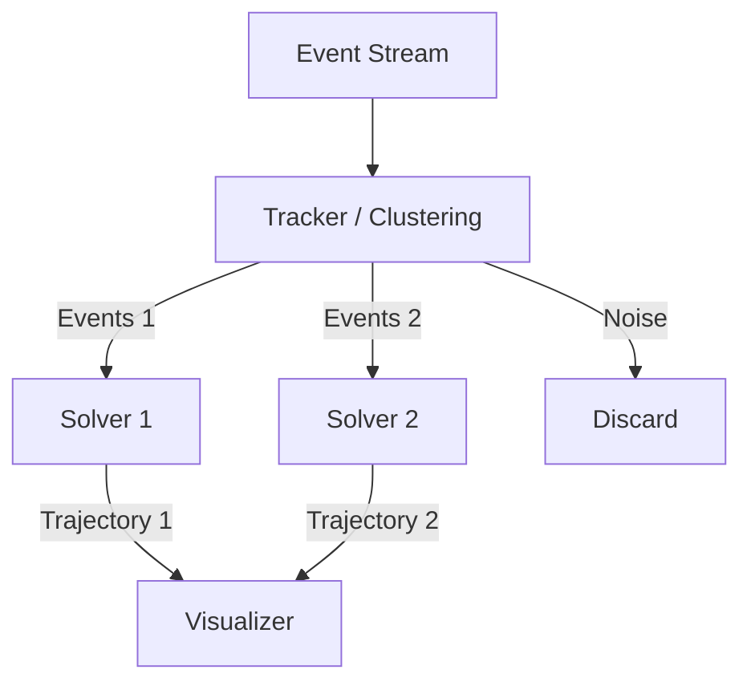

# Phase 4 Design: Multi-Instance Tracking

## 1. Overview

**Goal**: Track multiple drones simultaneously.
**Gap**: CMax-SLAM is a *global* method. It aligns the *entire* image. Multiple moving objects with different motions will conflict (blur each other out).
**Approach**: **Clustering Frontend** + **Multi-Pipeline Backend**.

---

## 2. Architecture

### 2.1 The "Tracker" (Frontend)
Before CMax optimization, we need to segment events into object clusters.
**Algorithm**: Spatiotemporal Clustering (e.g., DBSCAN or Grid-based connectivity).
-   **Input**: Stream of events.
-   **Output**: List of Clusters $\{C_1, C_2, ...\}$, where each $C_i$ contains a subset of events.

### 2.2 The "Solver" (Backend)
We instantiate a **CMax-SLAM Solver** for *each* active cluster.
-   **Solver 1**: Optimizes Trajectory $T_1$ for events in $C_1$.
-   **Solver 2**: Optimizes Trajectory $T_2$ for events in $C_2$.

---

## 3. Data Flow



---

## 4. Implementation Details

### 4.1 Clustering Shader (`cluster.wgsl`)
-   **Grid-Based**: Divide screen into $64 \times 64$ tiles.
-   **Activity Map**: Count events per tile.
-   **Connected Components**: Merge active tiles into blobs (RoIs).
-   **Assignment**: Assign each event to a Blob ID.

### 4.2 Multi-Dispatch Pipeline
Instead of one big dispatch, we iterate over active trackers.
```rust
for tracker in trackers.iter() {
    // 1. Upload events for this tracker
    // 2. Set uniforms (initial guess from tracker state)
    // 3. Dispatch CMax-SLAM (Phase 3 pipeline)
    // 4. Readback & Update
}
```

### 4.3 Data Association
-   **Prediction**: Use previous trajectory to predict where the object will be.
-   **Gating**: Only accept events within the predicted bounding box (plus margin).
-   **New Objects**: Unassigned events that form a dense cluster spawn a new tracker.
-   **Lost Objects**: Trackers with low contrast/variance for N frames are killed.

---

## 5. Risks & Mitigations

| Risk | Mitigation |
| :--- | :--- |
| **Performance** | Running N solvers is expensive. **Mitigation**: Use "Attention" mechanism. Only run full CMax on the RoI (Region of Interest), not full frame. Crop events before processing. |
| **Crossing Paths** | When drones cross, clusters merge. **Mitigation**: Use the velocity vector to disambiguate. If contrast drops during merge, freeze update and coast on prediction. |
| **Latency** | Clustering adds latency. **Mitigation**: Use a very simple heuristic (e.g., K-Means with predicted centers) instead of full DBSCAN. |

## 6. Plan

1.  **Clustering**: Implement simple grid-based blob detector.
2.  **Manager**: Create a `TrackerManager` resource to handle spawning/killing solvers.
3.  **Pipeline**: Refactor Phase 3 pipeline to support multiple instances (dynamic bind groups).
4.  **UI**: Draw bounding boxes and IDs for each tracked object.
